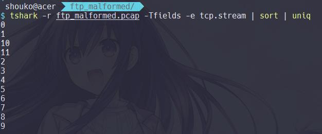
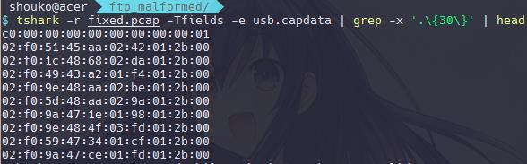

## Sketch of Remembrance  (500 pts)

### Description

>  I had a dream. It was a soothe and nostalgic ones, likely a forgotten utopia. After all, it was an utopia created by strange power called **\<Eden\>**. <br> Inside of it, there was a calm and gentle girl who acts like a traditional childhood friend to me. But, for a certain reason, I am unable to recall her name, no matter how hard I thought. <br> Day after day had passed like a cherry blossom in autumn. But, my memories already become faded-out along with the existence of this world.<br>At the last moment, I could heard her final word & saw her cherry smile. But, without having recalled *the girl* name, I had awakened from the hazy dream.<br>Here, I found a flower pendant in my drawer. It was a bit broken, but still, it felt quite nostalgic. I recalled the name of the flower pendant<br><br>*Myosotis*, in other words, **An undying love**<br><br>At that moment, I regained my hazy memories about her<br>
*R..i.n...n..e ...*

### Solution

Diberikan sebuah file attachment berupa `ftp_malformed.pcap` Kemudian akan
dilakukan network packet analysis menggunakan bantuan tshark CLI. Adapun
tahapannya ialah sebagai berikut

**Analyze FTP Packet**

   Pada tahap ini, proses analisis dimulai dengan mengenumerasi informasi terkait
statistik dari packet-data. Hasilnya dip 


Selanjutnya, dilakukan pengecekan terhadap TCP Stream untuk mengetahui FTP-Log yang memuat komunikasi antara client-server.




```bash

$ tshark -r ftp_malformed.pcap -z 'follow,tcp,raw,2' -z 'follow,tcp,raw,0' |\
  awk 'f;/Node 1/,/=/' | grep -Ev '=|Node' | xxd -r -p

220 (vsFTPd 3.0.3)
USER eden
331 Please specify the password.
PASS R1nne_utopia
230 Login successful.
PWD
257 "/ftp/eden" is the current directory
EPSV
229 Entering Extended Passive Mode (|||12021|)
TYPE I
200 Switching to Binary mode.
SIZE canvas.pcapng
213 438685
RETR canvas.pcapng
150 Opening BINARY mode data connection for canvas.pcapng (438685 bytes).
ABOR
426 Failure writing network stream.
QUIT
225 No transfer to ABOR.
221 Goodbye.
220 (vsFTPd 3.0.3)
USER eden
331 Please specify the password.
PASS R1nne_utopia
230 Login successful.
PWD
257 "/ftp/eden" is the current directory
EPSV
229 Entering Extended Passive Mode (|||12021|)
TYPE I
200 Switching to Binary mode.
SIZE canvas.pcapng
213 438685
REST 100000
350 Restart position accepted (100000).
RETR canvas.pcapng
150 Opening BINARY mode data connection for canvas.pcapng (438685 bytes).
ABOR
426 Failure writing network stream.
QUIT
225 No transfer to ABOR.
221 Goodbye.
```

Sebagaimana hasil penelusuran tersebut, diketahui bahwa terdapat sebuah komunikasi FTP antara 104.250.105.44 (server) dengan 202.43.92.132 (client) yang melibatkan proses file-transfer canvas.pcapng. Proses ini terbagi atas enam kali iterasi dengan mengambil **100000 bytes** sebagai offset dari binary file untuk setiap iterasinya.

Selanjutnya, dilakukan proses ekstraksi terhadap FTP-DATA untuk mendapatkan berkas `canvas.pcapng` yang diminta.

```bash
$ for i in {1..11..2}; do
	tshark -r ftp_malformed.pcap -q -z "follow,tcp,raw,$i" |\
	grep -Ev '=|Node|Follow|Filter' |\
	xxd -r -p >> canvas.pcapng
done

$ file canvas.pcapng
canvas.pcapng: tcpdump capture file (little-endian) - version 2.4, capture length 65535)
```

**Analyze  USB-PCAP Packet**

Pada tahap ini, kembali dilakukan proses enumerasi informasi terkait statistik dari packet-data. Hasilnya diperoleh:


Dari sini diketahui bahwa berkas `canvas.pcapng` yang didapat dari komunikasi FTP memuat serangakaian log aktivitas dari USB HID. Selanjutnya, dilakukan proses pengecekan terhadap `RESPONSE DEVICE DESCRIPTOR` guna keperluan identifikasi `idProduct` & `idVendor` dari USB device yang dijalankan. Adapun proses ini dapat dilakukan dengan bantuan Wireshark.


Hasilnya, diketahui bahwa USB Device yang digunakan adalah Wacom yang biasa digunakan sebagai **sketching device**. Berdasarkan pemahaman tersebut, didapatkan sebuah asumsi bahwa diperlukan proses plotting untuk setiap offset records pada `usb.capdata` sedemikian hingga didapatkan representasi citra sketsa yang sesuai.

Sebelum ekstraksi `usb.capdata` dimulai, dilakukan proses rekonstruksi terhadap **malformed_packet** mengingat terdapat beberapa bytes data yang hilang saat komunikasi FTP berlangsung. Adapun hal ini bersifat opsional, karena beberapa usb.capdata masih dapat didekripsikan tanpa proses rekonstruksi.

```bash
$ pcapfix canvas.pcapng -o fixed.pcap
pcapfix 1.1.4 (c) 2012-2019 Robert Krause

[*] Reading from file: canvas.pcapng
[*] Writing to file: fixed.pcap
[*] File size: 626015 bytes.
[+] This is a PCAP file.
[*] Analyzing Global Header...
[+] The global pcap header seems to be fine!
[*] Analyzing packets...
[+] CORRECTED Packet #834 at position 43405 (1532293347 | 655825 | 33 | 33).
[*] Progress:  20.00 %
[+] CORRECTED Packet #3975 at position 209982 (1532293379 | 789844 | 60886 | 60886).
[*] Progress:  43.27 %
[*] Progress:  60.00 %
[-] Packet #7339 at position 448645 is invalid ==> SKIPPING.
[*] Progress:  93.38 %
[+] CORRECTED Packet #7397 at position 587330 (1532293405 | 831870 | 35933 | 35933).
[*] Progress: 100.00 %
[*] Wrote 7454 packets to file.
[!] This corruption seems to be a result of an ascii-mode transferred pcap file via FTP.
[!] The pcap structure of those files can be repaired, but the data inside might still be corrupted!
[+] SUCCESS: 4 Corruption(s) fixed!
```

Kemudian, dilakukan proses ekstraksi usb.capdata untuk setiap records yang memuat tepat sembilan grup bit (nonad).



Dari sini, ditemukan sebanyak `6960 packet.frame` yang satisfiable dengan aturan nonad bit yang ada. Selanjutnya, dilakukan pemahaman terhadap representasi usb.capdata pada Wacom device, sebagaimana diuraikan pada tautan [berikut](https://blogs.tunelko.com/2017/02/05/bitsctf-tom-and-jerry-50-points/).


Sebagaimana diuraikan pada skema di atas, dapat dipahami bahwa proses penentuan offset memiliki dependency terhadap tiga variable, seperti `X`,`Y`, dan `pressure`. Kemudian, dilakukan penyeleksian untuk mendapatkan bits offset yang satisfiable dengan skema di atas.

```bash
$ tshark -r fixed.pcap -Tfields -e usb.capdata \|
   awk -F: '{x=$3$4;y=$5$6}{z=$7}$1=="02"{print x,y,z}'

5145 aa02 42
8000 8000 00
1c48 6802 da
4943 a201 f4
9e48 aa02 be
5d48 aa02 9a
9a47 1e01 98
8000 c000 00
9e48 4f03 fd
5947 3401 cf
.... .... ..
.... .... ..
0000 0000 00
8000 0000 00
```

Selanjutnya dilakukan proses konversi data untuk mendapatkan nilai koordinat (X,Y) yang bersesuaian.

```python
#!/usr/bin/python
from pwn import *
from struct import pack

def parse(row):
    x,y,z = map(lambda x :  int(x,16), row.strip().split())
    if z > 0:
        return u16(struct.pack(">H", x)), u16(pack(">H", y))

file = open('dump,txt').read().split('\n')
for i in file[:-1]:
    print parse(i)
```    

```bash
$ cat data.txt | head
17745 682
18460 616
17225 418
18590 682
18525 682
18330 286
18590 847
18265 308
18330 462
9880 990
```

Akhirnya, dilakukan proses data plotting dengan menggunakan GNUPLOT, sehingga didapat hasil sebagai berikut:

```bash
$ gnuplot -e "plot 'data.txt'; pause -1"
```


**FLAG : JOINTS19{ev3n_separat3d_th3se_feelings_w1ll_be_her3}**

### Catatan Penulis
Adanya unintended-bug pada proses file-transfer FTP, menyebabkan beberapa packet.frame di tengah iterasi menjadi malformed, sehingga mengakibatkan bagian yang hilang pada sketsa gambar. Namun, flag masih bisa terbaca. 

Berikut ini merupakan sketsa gambar asli sebelum proses FTP file-transfer, beserta referensi yang digunakan dalam pengaplikasian soal

**Pre-uploaded Image**


**Original Art by Tsunako (Character : Rinne Sonogami)**


[USB-Pcap Referrence ](https://ctftime.org/writeup/12589)