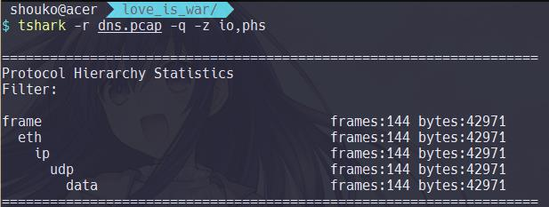
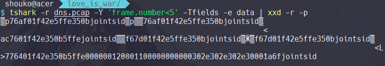
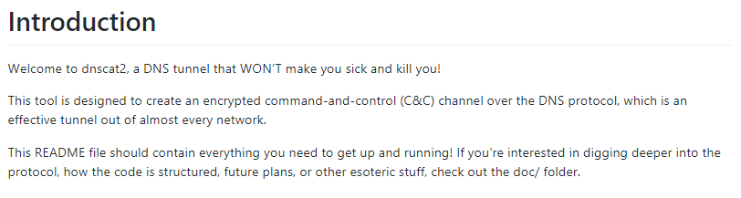
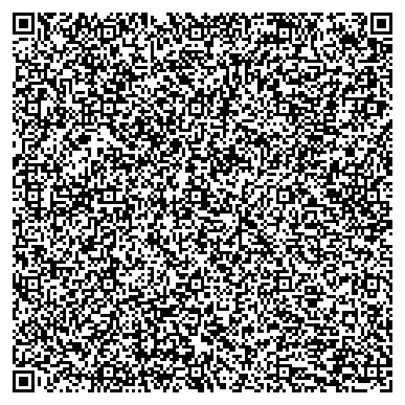
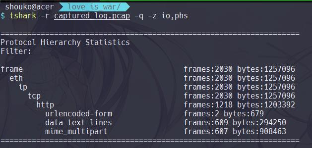
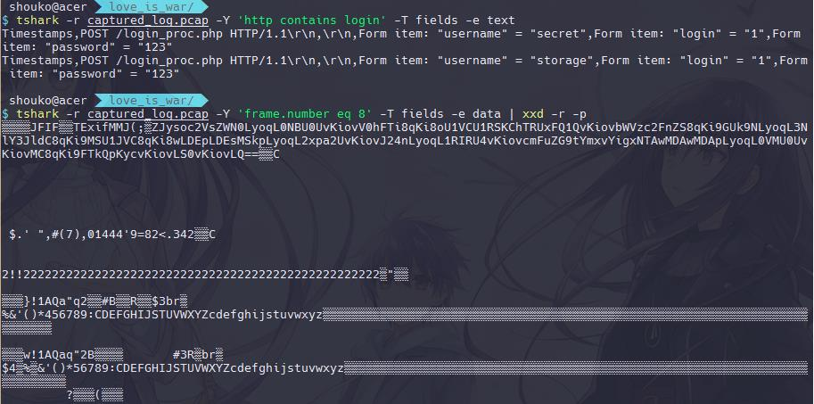
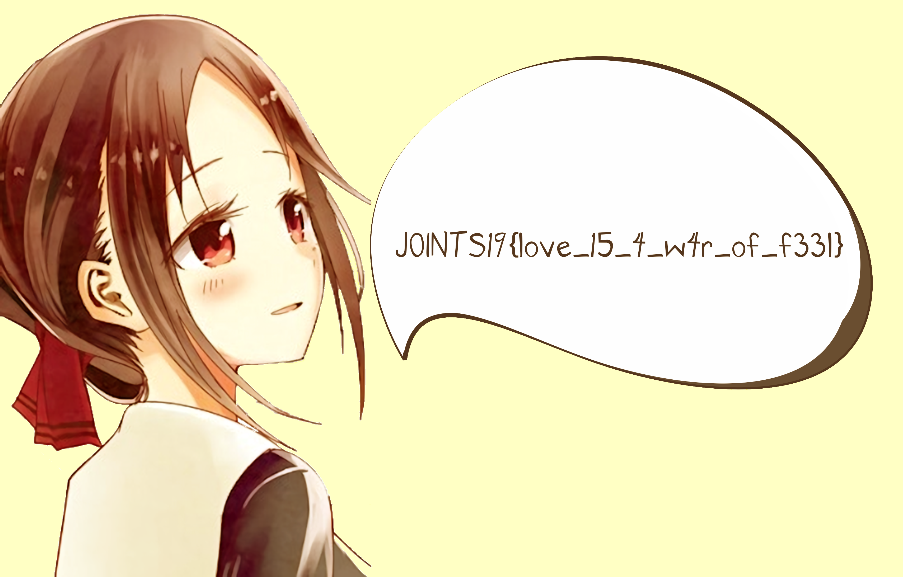

## Monolith Code of Regis  (500 pts)

### Description

>  Commonly, everyone believes that ..
.. Confessing your love and becoming a couple ..
.. Falling for someone ..
Is the most wonderful things in the world
 But, **THEY'RE WRONG!**
Because, `LOVE IS WAR`
That's mean, `THE ONE WHO CONFESSES THEIR LOVE FIRST LOSES!`
Here's another Love and Brains war of Kaguya-sama along with her dere-confession?!<br><br>
****Kaguya-sama Wants to Be Figured Out****
<br>
On a quiet night, Kaguya-sama thinks of an idea for agitating the inner thought of Prez
In other words, the `Prez's love confession`.<br><br>
Kaguya   : Ara..ara, Prez. Are you familiar with Twenty question game?<br>
Prez     : Ah, yeah. ****Gulp****<br>
Kaguya   : As the name suggests, If you afford to figure out the answer within 20 questions, you win. If you don't, the other player wins. But, since you can figure out almost anything with 20 questions, I'm really sure that Prez won't need that many, so we'll go with five instead. Are you ready?
Prez     : Sure. Let's play..<br><br>
`---- Then, the battle begins ----`<br>
Prez     : Is it something related to you?<br>
Kaguya   : Yes<br>
Prez     : Is it something you own right now?<br>
Kaguya   : No<br>
Prez     : Is it something you like?<br>
Kaguya   : Yes<br>
Prez     : Is it something you treasure much?<br>
Kaguya   : Yes<br>
Prez     : Is it something you ought to confess to me?<br>
Kaguya   : Ara..ara, why do you think about that, Prez? Are you excited for hearing my confession so badly?<br>
Kaguya   : Good grief, how cute ****evil grin****<br><br>
` ---- O Kawaii.. koto intensifies ----`<br><br>
Kaguya   : But, if you insist to learn about me, I have no choice but give Prez 2 more challenges. I'll tell my 
   secret, if you solve all of them by yourself... ****doki****


### Solution

Diberikan sebuah file-attachment berupa `dns.pcap`. Kemudian akan dilakukan network packet analysis menggunakan bantuan `tshark` CLI. Adapun skema yang dilakukan, diantaranya:

**Analyze DNS Query Name Field**

Sebagai permulaan, dilakukan pengecekan terhadap informasi statistik pada paket data. 



Hasilnya, diketahui bahwa paket data membuat 144 packet.frame pada UDP Layer. Selanjutnya, dilakukan pengecekan terhadap data field pada lima frame pertama.



Terlihat bahwa udp.data memuat informasi yang identik dengan dns query name. Akan tetapi, statistik yang ada tidak menunjukkan adanya dns segment pada UDP Layer, sehingga pernyataan sebelumnya menjadi kontradiktif. Untuk membuktikan premis sebelumnya, maka dilakukan pengecekan sekali lagi pada packet.data.

```bash
$ tshark -r dns.pcap | head -2
1   0.000000 0.000000000 202.43.92.132 → 104.250.105.44 UDP 88 59508 58  59508 → 58 Len=46
2   0.001032 0.001032000 104.250.105.44 → 202.43.92.132 UDP 132 58 59508  58 → 59508 Len=90

```
Dari sini, dapat dipahami bahwa terdapat komunikasi antara `202.43.92.132` dan `104.250.105.44` yang berjalan pada UDP Layer `port 58`, sehingga wajar saja apabila tshark tidak mengenali udp.data sebagai DNS Layer yang umumnya berjalan pada `port 53`. Adapun dilakukan penambahan argumen `–d filter`, protocol sebagai operator `'decode as'` pada tshark command:

```bash
$ tshark –r dns.pcap –d ‘udp.port==58,dns’ | head -5
1   0.000000 0.000000000 202.43.92.132 → 104.250.105.44 DNS 88 59508 58  Standard query 0xc670 MX 76af01f42e5ffe350b.joints.id
2   0.001032 0.001032000 104.250.105.44 → 202.43.92.132 DNS 132 58 59508  Standard query response 0xc670 MX 76af01f42e5ffe350b.joints.id MX 10 ac7601f42e350b5ffe.joints.id
3   1.013966 1.012934000 202.43.92.132 → 104.250.105.44 DNS 88 59508 58  Standard query 0x86d3 MX f67d01f42e5ffe350b.joints.id
4   1.015252 0.001286000 104.250.105.44 → 202.43.92.132 DNS 176 58 59508  Standard query response 0x86d3 MX f67d01f42e5ffe350b.joints.id MX 10 776401f42e350b5ffe000000120001100000000000302e302e302e30001a6f.joints.id
5   1.076787 0.061535000 202.43.92.132 → 104.250.105.44 DNS 297 59508 58  Standard query 0x18e7 MX 869a01f42e5ffe3521000000088001100000000000000008080000100100.00000068747470733a2f2f6769746875622e636f6d2f6961676f7838362f.646e73636174325c6e5c6e0d0a6956424f5277304b47676f414141414e53.556845556741414134634141414f4841514141414143.joints.id

```

Sebagaimana hasil tersebut, tampak terlihat bahwa terdapat `dns.query.name` yang memuat sekumpulan `hexstring`. Dari sini, muncul dugaan bahwa terdapat informasi yang disembunyikan pada field tersebut. Langsung saja dilakukan hex-decoding, sehingga diperoleh: 

```bash
$ echo 869a01f42e5ffe3521000000088001100000000000000008080000100100.00000068747470733a2f2f6769746875622e636f6d2f6961676f7838362f.646e73636174325c6e5c6e0d0a6956424f5277304b47676f414141414e53.556845556741414134634141414f4841514141414143 | tr -d '.' | xxd -r –p

▒▒▒._▒https://github.com/iagox86/dnscat2\n\n
iVBORw0KGgoAAAANSUhEUgAAA4cAAAOHAQAAAAC     

$ echo iVBORw0KGgoAAAANSUhEUgAAA4cAAAOHAQAAAAC | base64 -d
▒PNG

IHDR

```



Hasilnya, ditemukan informasi yang memuat repository `dnscat2` beserta `base64-encoded text` dari PNG-file. Sebagaimana tercantum pada GitHub repository,  dnscat2 merupakan sebuah tools yang memungkinkan network tunneling serta enkripsi data 
pada DNS Layer.

**Dump Embedded Message within DNS Query Name**

Setelah beberapa kali percobaan, diketahui terdapat `8 extra bytes` untuk setiap header pada instance `dns.qry.name`. Berdasarkan penemuan tersebut, dilakukan proses ekstraksi base64-encoded data sebagai berikut.

```bash
$ strings <<<\
  `tshark -r dns.pcap -d 'udp.port==58,dns' -Tfields -e dns.qry.name |\
   sed 's/.joints.id//g' | grep '\.' | sed 's/\.//g' | cut -c 18- |\
   uniq -c | xxd -r -p | tr -cd '[:alnum:]+/= .:'`| cut -c37- | rev |\
   cut -c29- | rev | base64 -d  > out
$ file out
out: PNG image data, 903 x 903, 1-bit grayscale, non-interlaced

```



Hasilnya, diperoleh sebuah PNG-file berupa QR-Code yang memuat informasi terkait dengan layer ke-2, sebagaimana telah diuraikan pada deskripsi soal.

```bash
$ python2 -c "import qrtools; qr=qrtools.QR(); qr.decode('out'); print qr.data"
Omedetou gozaimasu. Omigoto desu, Prez.
As expected from our Prez **Doki**

Here's the final challenge for my request to the Prez.
 The other day, I uploaded my secret to a certain Website.
 It was encrypted though, but you can easily find the passwd inside of the website

 Anyway, here's the link of my captured_log:
 https://drive.google.com/open?id=1rCM54rJd2Ex9wEtZZv6-r1dpWdhOcylW

Lastly, take your time as much as you need. I'll wait for your sincere answer.
But, to think you've tried so hard to learn about myself.

Mattaku, o kawaii koto desune...

$ gdrive_download 1rCM54rJd2Ex9wEtZZv6-r1dpWdhOcylW captured_log.pcap

$ file captured_log.pcap
captured_log.pcap: pcap-ng capture file - version 1.0

```

**Inspect HTTP Log**

Sebagai permulaan, dilakukan enumerasi terkait informasi statistik dari paket data.



Merujuk pada petunjuk sebelumnya, dapat diasumsikan bahwa terdapat sebuah encrypted file beserta password yang diupload pada webservice. Selain itu, berdasarkan statistik yang diperoleh, juga ditemukan beberapa `POST Request` yang memuat `plain-text` & `MIME data`. 

Dari sini, Kita bisa saja menduga bahwa flag tersimpan di antara uploaded file yang ada. Untuk membuktikan deduksi tersebut, langsung saja dilakukan pengecekan terhadap `HTTP fields`.

```bash
$ tshark -r captured_log.pcap -Y 'http.request.method eq POST' | head
4   0.000907 0.000000000 104.250.105.44 → 103.28.53.243 HTTP 339    POST /login_proc.php HTTP/1.1  (application/x-www-form-urlencoded)
8   0.169977 0.169070000 104.250.105.44 → 103.28.53.243 HTTP 1497    POST /up.php HTTP/1.1
12   4.215124 4.045147000 104.250.105.44 → 103.28.53.243 HTTP 1497    POST /up.php HTTP/1.1
16   7.529731 3.314607000 104.250.105.44 → 103.28.53.243 HTTP 1497    POST /up.php HTTP/1.1
19   8.232726 0.702995000 104.250.105.44 → 103.28.53.243 HTTP 1497    POST /up.php HTTP/1.1
22   8.552321 0.319595000 104.250.105.44 → 103.28.53.243 HTTP 1497    POST /up.php HTTP/1.1
25   8.587390 0.035069000 104.250.105.44 → 103.28.53.243 HTTP 1497    POST /up.php HTTP/1.1
28   8.648018 0.060628000 104.250.105.44 → 103.28.53.243 HTTP 1497    POST /up.php HTTP/1.1
31   8.756928 0.108910000 104.250.105.44 → 103.28.53.243 HTTP 1497    POST /up.php HTTP/1.1
34   8.881381 0.124453000 104.250.105.44 → 103.28.53.243 HTTP 1497    POST /up.php HTTP/1.1
```

Hasilnya, ditemukan log trace yang memuat komunikasi antara `104.250.105.44` (client) dan `103.28.53.243` (webserver) dimana client melakukan POST requests untuk `login authentication` & `file upload`. Selanjutnya, dilakukan pengecekan terhadap data fields untuk beberapa POST requests



Berdasarkan cuplikan tersebut, diketahui bahwa terdapat 2 buah kredential yang digunakan, yaitu `secret` & `storage`, serta sebuah JPEG-file yang memiliki Tag `iText` berupa base64-encoded text yang ekivalen dengan plain-text:

```bash
"'+(select/**/CASE/**/WHEN/**/(SUBSTR((SELECT/**/message/**/FROM/**/secret/**/LIMIT/**/0,1),1,1))/**/like/**/'4'/**/THEN/**/randomblob(150000000)/**/ELSE/**/0/**/END)+'/**/--/**/-"
```

Dari sini dapat dirumuskan skema pengerjaan sebagai berikut:

a. Sebagaimana diketahui sebelumnya, terdapat dua buah user credentials, yakni `secret` & `storage`. Kedua buah akun melakukan proses JPEG uploading dengan metadata yang satisfiable dengan `Time-based Blind SQLite`, yaitu sebanyak `1.5 detik` untuk setiap query yang benar.

Dari sini, alur pengerjaan dimulai dengan melakukan filter untuk setiap `frame.time_delta` (selisih waktu antar frame) yang satisfiable dengan kondisi di atas, sehingga didapatkan tcp.stream yang  tepat.

```bash
# storage
$ strings <<< `tshark -r captured_log.pcap -Y 'http.request.method==POST and frame.time_delta > 1.5 and frame.number > 533' -T fields -e data | xxd -r -p` |  grep Jy | while read i; do echo $i | base64 -d | cut -d "'" -f 3 | tr -d '\n'; done

storages/f3c5f0b3f6da24ab564228cbe24b40ca/519091e0a95a0d0d34c695a6f2d5dd93.zip

# secret
$ strings <<< `tshark -r captured_log.pcap -Y 'http.request.method==POST and frame.time_delta > 1.5 and frame.number < 533' -T fields -e data | xxd -r -p` |  grep Jy | while read i; do echo $i | base64 -d | cut -d "'" -f 3 | tr -d '\n'; done
4_h0pe_of_tru3_undy1ng_l0v3
```

b.	Selanjutnya dengan mengasumsikan, secret sebagai password dan storage sebagai pathname, dilakukan pengecekan terhadap `hostname` webserver yang digunakan.

```bash
$ tshark -r captured_log.pcap -T fields -e http.host | sort | uniq
challs.phionify.web.id

```

c.	Terakhir dilakukan proses file retrieving dari `hostname + pathname`, sedemikian hingga didapatkan ZIP archive, sebut saja `flag.zip`. Kemudian dilakukan ekstraksi dengan password yang telah diperoleh, sehingga didapatkan flag.png yang memuat flag

```bash
$ wget -Oflag.zip https://challs.phionify.web.id/storages/f3c5f0b3f6da24ab564228cbe24b40ca/519091e0a95a0d0d34c695a6f2d5dd93.zip
2019-04-13 23:08:19 (765 KB/s) - ‘flag.zip’ saved [1945609/1945609]

$ 7z x -p4_h0pe_of_tru3_undy1ng_l0v3 flag.zip

```



**FLAG : JOINTS19{love_15_4_w4r_of_f33l}**

#### Catatan penulis:

Skema yang digunakan pada layer-1 sesuai dengan guidelines yang tertera pada https://github.com/iagox86/dnscat2.

Sementara, skema yang digunakan pada layer-2 melibatkan komunikasi tunneled-interface untuk melakukan eksploitasi webservice (yang saat ini sudah nonaktif) dengan metode Time-based Boolean Blind Sqlite Injection. 