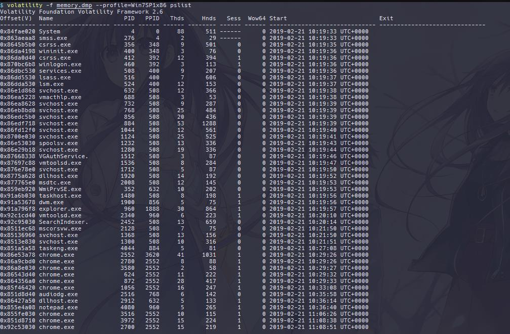

## Memori  (500 pts)

### Description

>  Kamu bertugas sebagai seorang forensik analis dan baru saja mendapat tugas untuk menganalisis sebuah file memory. Partnermu mengatakan bahwa ada tiga potongan informasi penting yang tersembunyi di memori tersebut, temukanlah ketiga potongan tersebut!

### Solution

Diberikan file attachment berupa `memory.dmp`. Kemudian akan dilakukan memory dump analysis menggunakan bantuan Volatility untuk mendapatkan ketiga potongan informasi yang diminta. Adapun skema yang dilakukan ialah sebagai berikut:

**Analyze Memory Profile & Background Process**

Sebagai permulaan dari petunjuk pengerjaan, dilakukan identifikasi OS profile dengan plugin kdbgscan.

```bash
$ volatility -f memory.dmp kdbgscan
Volatility Foundation Volatility Framework 2.6
**************************************************
Instantiating KDBG using: Kernel AS WinXPSP2x86 (5.1.0 32bit)
Offset (V)                    : 0x8292cbe8
Offset (P)                    : 0x292cbe8
KDBG owner tag check          : True
Profile suggestion (KDBGHeader): Win7SP1x86_23418
Version64                     : 0x8292cbc0 (Major: 15, Minor: 7600)
Service Pack (CmNtCSDVersion) : 0
Build string (NtBuildLab)     : 7600.16385.x86fre.win7_rtm.09071
PsActiveProcessHead           : 0x82944e98 (46 processes)
PsLoadedModuleList            : 0x8294c810 (150 modules)
KernelBase                    : 0x82804000 (Matches MZ: True)
Major (OptionalHeader)        : 6
Minor (OptionalHeader)        : 1
KPCR                          : 0x8292dc00 (CPU 0)

**************************************************
Instantiating KDBG using: Kernel AS WinXPSP2x86 (5.1.0 32bit)
Offset (V)                    : 0x8292cbe8
Offset (P)                    : 0x292cbe8
KDBG owner tag check          : True
Profile suggestion (KDBGHeader): Win7SP1x86
Version64                     : 0x8292cbc0 (Major: 15, Minor: 7600)
Service Pack (CmNtCSDVersion) : 0
Build string (NtBuildLab)     : 7600.16385.x86fre.win7_rtm.09071
PsActiveProcessHead           : 0x82944e98 (46 processes)
PsLoadedModuleList            : 0x8294c810 (150 modules)
KernelBase                    : 0x82804000 (Matches MZ: True)
Major (OptionalHeader)        : 6
Minor (OptionalHeader)        : 1
KPCR                          : 0x8292dc00 (CPU 0)

**************************************************
Instantiating KDBG using: Kernel AS WinXPSP2x86 (5.1.0 32bit)
Offset (V)                    : 0x8292cbe8
Offset (P)                    : 0x292cbe8
KDBG owner tag check          : True
Profile suggestion (KDBGHeader): Win7SP0x86
Version64                     : 0x8292cbc0 (Major: 15, Minor: 7600)
Service Pack (CmNtCSDVersion) : 0
Build string (NtBuildLab)     : 7600.16385.x86fre.win7_rtm.09071
PsActiveProcessHead           : 0x82944e98 (46 processes)
PsLoadedModuleList            : 0x8294c810 (150 modules)
KernelBase                    : 0x82804000 (Matches MZ: True)
Major (OptionalHeader)        : 6
Minor (OptionalHeader)        : 1
KPCR                          : 0x8292dc00 (CPU 0)

```

Hasilnya, diperoleh `Win7SP1x86` sebagai opsi profile yang dipilih. Selanjutnya untuk memperoleh informasi general mengenai Running processes dari snapshot memori, dilakukan command pslist. 



**Analyze Potential Background Processes**

Sebagaimana diketahui pada cuplikan pslist di atas, diambil sebuah asumsi bahwa potongan informasi yang dimaksud, mungkin saja tersimpan pada proses `notepad.exe` & `chrome.exe` mengingat kedua proses tersebut bukanlah program yang biasa dijalankan secara default. Berangkat dari asumsi itulah, proses penelusuran dimulai.

#### notepad.exe

Berbicara mengenai notepad, hal yang pertama muncul di perspektif penulis adalah informasi yang disembunyikan pada TXT file, dengan kata lain sebuah `plain-text.` Berbekal pemahaman tersebut, dilakukan pencarian file dengan ekstensi `*.txt` menggunakan plugin filescan.


Hasilnya, diperoleh file hekelmensecret.txt yang kemungkinan memuat salah satu dari ketiga informasi. Hasilnya ditemukan potongan pertama dari flag.

```bash
$ volatility -f memory.dmp --profile=Win7SP1x86 dumpfiles -Q 0x000000003e1d4e70 --name -D .
Volatility Foundation Volatility Framework 2.6
DataSectionObject 0x3e1d4e70 None   \Device\HarddiskVolume1\Users\User1\Desktop\hekelmensecret.txt

$ cat file.None.0x92dd0008.hekelmensecret.txt.dat
4A4F494E545331397B50307733725F30665F

21/2/2019 : Installed password manager, maybe I will use it later – hekelmen

$ echo 4A4F494E545331397B50307733725F30665F | xxd -r -p
JOINTS19{P0w3r_0f_                                     
```

#### chrome.exe

Berdasarkan penelusuran sebelumnya, diketahui bahwa terdapat satu suspect user, yaitu `hekelmen`, yang diduga melakukan eksploitasi pada sistem. Selanjutnya, untuk menelusuri activity log yang ia lakukan, dilakukan penelusuran dengan plugin `chromehistory`.


Hasilnya, diketahui bahwa terdapat history log yang mengarah ke URL https://ctf.asgama.web.id. Untuk memperkecil scope pencarian, dilakukan proses memdump terlebih dahulu untuk process dengan `PID 2552 (chrome.exe)`

```bash
$ volatility -f memory.dmp --profile=Win7SP1x86 memdump -p 2552 -D .
Volatility Foundation Volatility Framework 2.6
************************************************************************
Writing chrome.exe [  2552] to 2552.dmp

```

Selanjutnya, mengacu pada petunjuk password manager yang didapatkan sebelumnya, dilakukan penelusuran sebagai berikut.

```bash
$ strings 2552.dmp | egrep -i 'asgama.web.id' -A 25 \|
  grep -i 'password manager' | head
  
  stPass, an award-winning password manager, saves your passwords and gives you secure access from every computer and mobile device.
  hdlcegeplioahd/relatedLastPass: Free Password Manager - Chrome Web Store
  LastPass: Free Password Manager
  LastPass: Free Password Manager
  LastPass: Free Password Manager

```

Hasilnya, didapat dugaan bahwa `hekelmen` menggunakan LastPass extension untuk menyimpan informasi user-creds miliknya. Pada tahap ini, Kita bisa saja menggunakan plugin Lastpass untuk mengekstrak informasi tersebut.

```bash
$ volatility -f memory.dmp --profile=Win7SP1x86 lastpass
Volatility Foundation Volatility Framework 2.6
Searching for LastPass Signatures
Found pattern in Process: chrome.exe (2552)
Found pattern in Process: chrome.exe (2552)
Found pattern in Process: chrome.exe (1056)
Found pattern in Process: chrome.exe (1056)
Found pattern in Process: chrome.exe (1056)
Found pattern in Process: chrome.exe (1056)
Found pattern in Process: chrome.exe (1056)
Found pattern in Process: chrome.exe (1056)
Found pattern in Process: chrome.exe (1056)
Found pattern in Process: chrome.exe (1056)
Found pattern in Process: chrome.exe (1056)
Found pattern in Process: chrome.exe (1056)
Found pattern in Process: chrome.exe (1056)
Found pattern in Process: chrome.exe (1056)
Found pattern in Process: chrome.exe (3972)
Found pattern in Process: chrome.exe (3972)
Found pattern in Process: chrome.exe (3972)
Found pattern in Process: chrome.exe (3972)

Found LastPass Entry for asgama.web.id
UserName: Unknown
Pasword: Unknown

Found LastPass Entry for //ctf.asgama.web.id/login
UserName: name
Pasword: D_R3c0n_C0mb1n3d%7D

```

Atau dapat juga dilakukan menggunakan strings dumps dengan filter username hekel.

```bash
$ strings 2552.dmp | egrep -i 'asgama.web.id' -A 25 | grep -i 'hekel' | head -5
\",\"sn\":0,\"unencryptedUsername\":\"hekelmen\",\"url\":\"https://ctf.asgama.web.id/register\",\"name\":\"asgama.web.id\",\"domain\":\"asgama.web.id\",\"domainSites\":0,\"encname\":\"!^
 \\t4\",\"tld\":\"asgama.web.id\",\"groupid\":\"\",\"deleted\":\"\",\"attachkey\":\"\",\"attachpresent\":\"\",\"notetype\":\"\",\"noalert\":\"\",\"last_modified_gmt\":\"\",\"hasbeenshared\":\"\",\"last_pwchange_gmt\":\"\",\"created_gmt\":\"\",\"vulnerable\":\"\",\"pwch\":\"0\",\"breached\":\"0\",\"template\":\"\",\"realmmatch\":false,\"servermatch\":true,\"portmatch\":true,\"serverportmatch\":1,\"usernamematch\":false,\"urlmatch\":false,\"pathlevelmatch\":1,\"fieldmatchcount\":0,\"useusername\":\"hekelmen\"}}","formfills":"{}","ff":"{\"en-US\":{\"month1\":\"January\",\"month2\":\"February\",\"month3\":\"March\",\"month4\":\"April\",\"month5\":\"May\",\"month6\":\"June\",\"month7\":\"July\",\"month8\":\"August\",\"month9\":\"September\",\"month10\":\"October\",\"month11\":\"November\",\"month12\":\"December\",\"mon1\":\"Jan\",\"mon2\":\"Feb\",\"mon3\":\"Mar\",\"mon4\":\"Apr\",\"mon5\":\"May\",\"mon6\":\"Jun\",\"mon7\":\"Jul\",\"mon8\":\"Aug\",\"mon9\":\"Sep\",\"mon10\":\"Oct\",\"mon11\":\"Nov\",\"mon12\":\"Dec\",\"InsecureSite\":\"You are currently browsing an insecure website.\\n\\nAre you sure you want LastPass to fill your credit card information into this site?\",\"AskBeforeFillCC\":\"Are you sure you want LastPass to fill your credit card information into this site?\",\"AskBeforeFill\":\"Are you sure you want LastPass to fill your information into this site:\",\"AskBeforeFillProfile\":\"Are you sure you want LastPass to fill your information into this site?\",\"do_not_remove_the_above_blank_line\":\"dummy\",\"ff_currpass_regexp\":\"(?:(?:existing|^old|[^h]old|curr|former).*pass)|(?:pass.*(?:existing|[^h]old|curr|former))\",\"ff_maiden_regexp\":\"maiden\",\"ff_firstname_regexp\":\"(?:name.*first)|(?:first.*name)|^first$\",\"ff_text_firstname_regexp\":\"(?:name.*first)|(?:first(?!.*last).*name)|^first$\",\"ff_middlename_regexp\":\"(?:name.*middle)|(?:middle.*name)|^middle$\",\"ff_middleinitial_regexp\":\"(?:init.*middle)|(?:middle.*init)|(?:name.*(?:middle|mi$))|(?:(?:middle|mi).*name)|(?:mi$)\",\"ff_text_middleinitial_regexp\":\"(?:init.*middle)|(?:middle.*init)|(?:name.*(?:middle|mi$))|(?:m.?i.?:?$)\",\"ff_lastname_regexp\":\"(?:name.*last)|su
https://ctf.asgama.web.id/loginhttps://ctf.asgama.web.id/loginnamehekelmenpassword
generateHkKeyCode":"71.0","generateHkMods":"alt","homeHkKeyCode":"72.0","homeHkMods":"control alt","logoffHkKeyCode":"0.0","logoffHkMods":"","nextHkKeyCode":"33.0","nextHkMods":"alt","openpopoverHkKeyCode":"220.0","openpopoverHkMods":"alt","prevHkKeyCode":"34.0","prevHkMods":"alt","recheckHkKeyCode":"73.0","recheckHkMods":"alt","rememberemail":"1.0","rememberpassword":"0.0","saveallHkKeyCode":"0.0","saveallHkMods":"","searchHkKeyCode":"87.0","searchHkMods":"alt","showvault":"1.0","submitHkKeyCode":"0.0","submitHkMods":""},"g_sites_tld":[{"aid":"1104578255103663732","name":"asgama.web.id","username":"hekelmen","fiid":"1104578255103663732","type":"account"}],"g_can_clear_clipboard":false,"g_can_copy_to_clipboard":true,"g_is_chrome_portable":false,"g_user_debug_enabled":false,"g_have_binary":false,"extensionBaseURL":"chrome-extension://hdokiejnpimakedhajhdlcegeplioahd/"}]},"frameID":36}
asgama.web.id id.web.asgama.ctf hekelman@gmail.com D_R3c0n_C0mb1n3d} – https

```

**Inspect the NTLM Windows Credentials**

Pada tahap ini, dua potongan flag telah berhasil diperoleh, sehingga dibutuhkan satu potongan lagi untuk melengkapi informasi yang ada. Dari sini, didapat dugaan lainnya bahwa mungkin saja hekelmen meninggalkan `credentials trace` lainnya di dalam system. 

Merujuk pada hasil `pslist` sebelumnya, diketahui bahwa tidak terdapat background process lain yang potensial untuk menyimpan sebuah credentials. Oleh karena itu, scope penulusuran dialihkan pada `Windows User`. Untuk itu dilakukan percobaan ekstraksi informasi dengan plugin `mimikatz`.

```bash
$ volatility -f memory.dmp --profile=Win7SP1x86 mimikatz
Volatility Foundation Volatility Framework 2.6
WARNING : volatility.debug    : [LsaDecryptor] unable to find signature!
Module   User             Domain           Password
-------- ---------------- ---------------- ----------------------------------------
wdigest  User1            WIN-92HT6VIQAKH
wdigest  WIN-92HT6VIQAKH$ WORKGROUP

```

Hasilnya, diperoleh stderr `LsaDecryptor` tentang signature hash yang `tidak ditemukan`. Dari sini, didapat asumsi bahwa mungkin saja terdapat creds lain dengan password yang tidak umum & tidak terentry pada wordlist. 

Alternatifnya, dilakukan 
proses ekstraksi kembali dengan plugin `hashdump`


Hasilnya, ditemukan user creds lain bernama hekelmen dengan `2703ec09324eb85c3fb21f6da716963b` sebagai signature dari `NTLM hash`. Untuk itu, dilakukan dekripsi dengan web berikut. Adapun, didapatkan potongan informasi terakhir pada plain-text hasil dekripsi.


**FLAG : JOINTS19{P0w3r_0f_F0r3n51cs_4nD_R3c0n_C0mb1n3d}**

#### Catatan penulis : -
