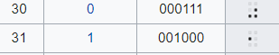

## Monolith Code of Regis  (500 pts)

### Description

>  An ancient gylph data was captured during an investigation of a certain webpage. Based on the captured logfile, there are some suspicious communications within a tunneled network. According to the analyst, these informations refers to the Regis Realm, a realm where the Legendary Titan was asleep and sealed.

### Solution

Diberikan sebuah file-attachment berupa capture.pcap. Kemudian akan dilakukan network packet analysis menggunakan bantuan tshark CLI. Berikut ini merupakan skema yang digunakan untuk memperoleh flag yang diminta.

**Analyze HTTP-Stream over ICMP Tunneling**

Pada tahap ini, dilakukan proses enumerasi informasi terkait statistik packet-data yang ada. Hasilnya, diperoleh:


```bash
$ tshark -r captured.pcap | head

1   0.000000 0.000000000 202.43.92.132 → 104.250.105.44 ICMP 47    Echo (ping) request  id=0x20a3, seq=27445/13675, ttl=55
2   0.000035 0.000035000 104.250.105.44 → 202.43.92.132 ICMP 47    Echo (ping) reply    id=0x20a3, seq=27445/13675, ttl=64 (request in 1)
3   2.000262 2.000227000 202.43.92.132 → 104.250.105.44 ICMP 47    Echo (ping) request  id=0x20a3, seq=27445/13675, ttl=55
4   2.000313 0.000051000 104.250.105.44 → 202.43.92.132 ICMP 47    Echo (ping) reply    id=0x20a3, seq=27445/13675, ttl=64 (request in 3)
5   2.425072 0.424759000 202.43.92.132 → 104.250.105.44 ICMP 107    Echo (ping) request  id=0x20a3, seq=27445/13675, ttl=55
6   2.425107 0.000035000 104.250.105.44 → 202.43.92.132 ICMP 107    Echo (ping) reply    id=0x20a3, seq=27445/13675, ttl=64 (request in 5)
7   2.425284 0.000177000 104.250.105.44 → 202.43.92.132 ICMP 107    Echo (ping) reply    id=0x20a3, seq=27445/13675, ttl=64
8   2.436848 0.011564000 202.43.92.132 → 104.250.105.44 ICMP 47    Echo (ping) request  id=0x20a3, seq=27445/13675, ttl=55
9   2.436869 0.000021000 104.250.105.44 → 202.43.92.132 ICMP 47    Echo (ping) reply    id=0x20a3, seq=27445/13675, ttl=64 (request in 8)
10   2.436879 0.000010000 202.43.92.132 → 104.250.105.44 ICMP 99    Echo (ping) request  id=0x20a3, seq=27445/13675, ttl=55

```

Berdasarkan informasi di atas, dapat dipahami bahwa terdapat `7226 frame records` yang memuat komunikasi antara **104.250.105.44** (server) & **202.43.92.132** (client) pada ICMP Layer. Selain itu, ditemukan dua pola header berulang pada ICMP data field, yaitu `hans` & `hanc`.


Setelah beberapa penulusuran, diketahui bahwa karakteristik pada packet-data identik dengan skema ICMP Tunneling yang dilakukan menggunakan [Hans](http://code.gerade.org/hans/).

Hans merupakan tools yang memungkinan proses tunneling IPv4 pada ICMP layer (PING Tunnel) antara dua buah host dengan otoritas super-user. 
Pada pengaplikasiannya, Hans melakukan header assignment sesuai dengan requests & response yang terjadi pada IPv4 layer. Singkatnya, header `hanc` diassign pada client, sedangkan `hans` diassign pada server. 

Dari sini, Kita dapat berasumsi bahwa sebuah packet.frame sepanjang 117 bytes terbagi atas:

	14 bytes Ethernet Header 
	75 bytes ICMP Packet Data portion
    Some bytes of External IP header + ICMP header

Selanjutnya, dengan menghitung selisih dari panjang packet.frame dengan (EH+Data), lalu ditambahkan dengan panjang ICMP header tunnel (5 bytes), maka akan didapatkan offset dimana IPv4 disimpan. Selanjutnya, dilakukan proses chopping dengan bantuan editcap.

```bash
$ editcap -C 14:33 -F pcap captured.pcap ipv4.pcap

$ file ipv4.pcap
ipv4.pcap: tcpdump capture file (little-endian) - version 2.4 (Ethernet, capture length 262144)

```

**Analyze CSS nth-child() rule**

Setelah IPv4 data berhasil diperoleh, dilakukan kembali analisis dengan mengecek HTTP records. Adapun hasilnya ialah sebagai berikut:

```bash
$ tshark -r ipv4.pcap -Y http | head -3
12   2.436885 0.000000000 10.2.33.100 → 10.22.33.1   HTTP 254    GET /style.css HTTP/1.1
16   2.437378 0.000493000   10.22.33.1 → 10.22.33.100 HTTP 634    HTTP/1.1 200 OK  (text/css)
39  2.462235 0.024857000 10.22.33.100 → 10.22.33.1   HTTP 336    POST / HTTP/1.1  (application/x-www-form-urlencoded)

```


Dari sini, dapat diketahui bahwa terdapat beberapa POST Request yang memuat Command Execution yang melakukan request `flag.zip` pada server. Sayangnya, tidak terdapat tcp.stream yang secara eksplisit memuat isi dari ZIP-archive.

Kemudian, untuk mempermudah proses pengecekan, dilakukan proses ekstraksi `HTTP Object` dengan bantuan **Wireshark**. Hasilnya, diperoleh beberapa static HTML file & sebuah CSS file.


Dari sini, Kita dapat melakukan pengecekan terhadap salah satu HTML file pada browser. Hasilnya diperoleh:


Merujuk pada judul dan deskripsi soal, diketahui bahwa pesan dikirimkan dalam bentuk `monolith glyph` yang berhubungan dengan `Legendary Titans`.

Apabila dicermati lebih lanjut pada POST data, Legendary Titans yang dimaksud menunjuk pada entitas `Regirock, Regice, Registeel`. Sedangkan, monolith glyph menunjuk representasi `1` dan `0 `pada [ASCII Braille glyph](https://en.wikipedia.org/wiki/Braille_ASCII).




Dari sini, dapat disimpulkan bahwa diperlukan proses dekripsi potongan kode braille sedemikian hingga diperoleh binary `flag.zip` beserta `passphrase.txt`. Akan tetapi, potongan braille terbilang cukup banyak untuk diproses secara manual. Untuk itu, dilakukan proses scraping & parsing untuk mendapatkan plain-text dari HTML. 

**> %5c(5).html**


**> style.css**


Berdasarkan code snippet tersebut, skema yang akan dijalankan ialah sebagai berikut:

a. Dilakukan proses scraping dengan mengambil elemen HTML dengan class row. Kemudian, untuk setiap elemen row, dilakukan pengambilan untuk child-class dibawahnya yaitu block. Pada tahap ini, setiap karakter akan terbagi ke dalam beberapa baris, dengan 5 buah block area per barisnya.

b. Untuk setiap block area yang ada, dilakukan parsing terhadap class dot untuk menentukan iterasi manakah yang memuat `Braille glyph`.

c. Kemudian dilakukan proses seleksi sesuai dengan `nth-child() rule` sebagaimana dijelaskan pada CSS. Dalam konteks ini, karakter 1 ditandai dengan kemunculan elemen dot pada iterasi genap & vice versa.

d. Dilakukan string concatenation untuk karakter `1` dan `0` yang diperoleh. Kemudian  dilakukan decoding terhadap binary string menjadi ASCII

Berikut ini merupakan source-code beserta hasil pemrosesan skema di atas:

```python
from bs4 import BeautifulSoup
from glob import glob
import os

def parse(filename):
	html  = open(filename).read()	
	soup  = BeautifulSoup(html,'lxml')
	row   = soup.select('div[class="row"]')
	block = [i.select('div[class="block"]') for i in row]
	res   = ''

	for i in block:
		init = [1 if j.find('div') else 0 for j in i]
		for count, dot in enumerate(init):
			if dot:
				res += ('0','1')[not count%2]

	data = [int(res[i:i+8], 2)for i in range(0,len(res),8)]
	return ''.join(map(chr,data))

file = glob('dump/*.html')
res  = []
for i,j in enumerate(file):
	res += [parse(j)]
	print '%s\n%s\n' % (j,res[i])

print '[+] Getting flag'
data = res[5]
out  = data.replace(' \n','')
open('flag.zip','wb').write(out.decode('base64'))
os.popen('7z x -p{} flag.zip'.format(res[4])) 
os.system('cat flag.txt')

```

```bash
dump/%5c(11).html
uid=33(www-data) gid=33(www-data) groups=33(www-data)

dump/%5c(14).html
/var/www/html/monolith_code_of_regis

dump/%5c(17).html
total 24 drwxrwxrwx 2 root root 4096 Feb 3 20:57 . drwxr-xr-x 3 root root 4096 Feb 3 19:33 .. -rwxr-xr-x 1 1000 1000 269 Feb 3 19:28 flag.zip -rwxr-xr-x 1 1000 1000 1404 Feb 3 20:57 index.php -rwxr-xr-x 1 1000 1000 72 Feb 3 19:28 passphrase.txt -rwxr-xr-x 1 1000 1000 535 Feb 3 19:28 style.css

dump/%5c(2).html
Hello, World!

dump/%5c(20).html
4b6134794a75714e514359575553314b727a6a626b706545746a37445462466b555a5846

dump/%5c(23).html
UEsDBBQACQBjAF2IOE5CeH2HUQAAADMAAAAIAAsAZmxhZy50eHQBmQcAAQBBRQMIAL0VmOeTK5Uf Jtgjw+9XzrhzSFrw3e/ZfcaSOLeOsm9VOyXF7bi3qnfpWUChpTJbNwwNtacnLAE06vuXf4TsUzZ/ FKZ0LFjWVzLxC5kpkLPPFVBLBwhCeH2HUQAAADMAAABQSwECHwAUAAkAYwBdiDhOQnh9h1EAAAAz AAAACAAvAAAAAAAAACAAAAAAAAAAZmxhZy50eHQKACAAAAAAAAEAGAAt4wn8y7PUAVkrCm7Ls9QB WSsKbsuz1AEBmQcAAQBBRQMIAFBLBQYAAAAAAQABAGUAAACSAAAAAAA=

dump/%5c(5).html
JOINTS19{%s}

dump/%5c(8).html
https://bulbapedia.bulbagarden.net/wiki/Legendary_titans

[+] Getting flag
JOINTS19{r3v3rse_4_sequ3nces_of_css_nth_ch1ld_rul3}   
```

**FLAG : JOINTS19{r3v3rse_4_sequ3nces_of_css_nth_ch1ld_rul3}**

### Catatan penulis
Skema yang digunakan pada layer-1 sesuai dengan guidelines yang tertera pada https://github.com/friedrich/hans. Sementara skema yang digunakan pada layer-2 menggunakan single-page PHP server side untuk memproses code execution dari input body params.

[ICMP Tunneling Referrence](https://ctftime.org/task/7505)